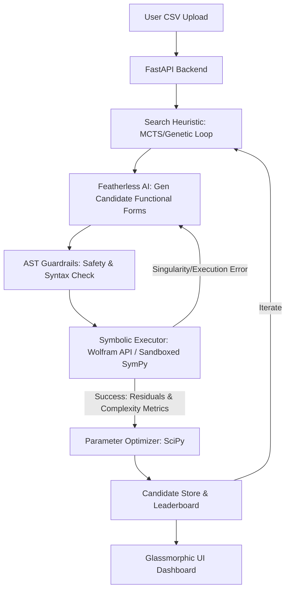

# Architectural Plan: Neuro-Symbolic Equation & Hypothesis Engine

This document details the system design, API integrations, and code structure for the Reverie Hacks DevOps Hackathon.

## 1. System Overview

The engine acts as an automated "AI Scientist" that discovers optimal mathematical models for raw numerical datasets. It combines the reasoning of LLMs with the deterministic execution of symbolic computation engines (Wolfram API / SymPy).



---

## 2. API Integrations & Stack

1. **Inference (Featherless AI)**:
   - *Models*: DeepSeek-V3 / Qwen-2.5-Coder-32B (for generating symbolic representations, mathematical code, and correction prompts).
2. **Computation (Wolfram Cloud API & local SymPy)**:
   - *SymPy*: Local validation, algebraic simplification, and initial sanity checks.
   - *Wolfram Cloud API*: Advanced calculus, integration, numerical equation solving, and handling singularities.
3. **Deployment (Render)**:
   - FastAPI web server hosting both the REST API and the glassmorphic static dashboard.
4. **Scraping (Firecrawl)**:
   - Scrapes online mathematical databases (like OEIS or physics catalogs) if the user inputs a physics/science problem domain to retrieve potential base formulas.

---

## 3. Directory Layout

We will organize the code under the `ReverieHacks` folder as follows:

```text
ReverieHacks/
├── README.md               # Hackathon Overview
├── architecture.md         # This document
├── requirements.txt        # Backend dependencies
├── main.py                 # FastAPI Web Server
├── config.py               # API keys & global configurations
├── engine/                 # Core logic
│   ├── __init__.py
│   ├── generator.py        # Featherless AI connection (Prompting & SOPs)
│   ├── executor.py         # Wolfram & SymPy sandboxed execution
│   ├── search.py           # MCTS / Genetic search loop
│   └── optimizer.py        # Parameter fitting (SciPy Curve Fit)
└── static/                 # Glassmorphic UI Dashboard
    ├── index.html
    ├── style.css
    └── app.js
```

---

## 4. Design Aesthetics (Frontend)
The user interface will be built using a **premium dark-mode glassmorphic theme** featuring:
- Gradient borders and frosted glass cards (`backdrop-filter`).
- Soft neon accent lighting (cyan and purple).
- Live interactive charts (using Chart.js or Plotly.js) showing the raw data points overlaid with the current best-fit equation.
- A scrolling console terminal showing the agent's real-time reasoning and self-healing logs.
